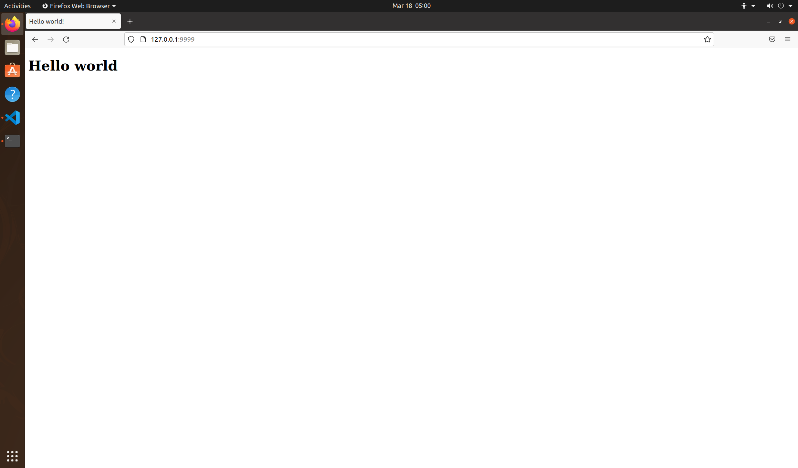
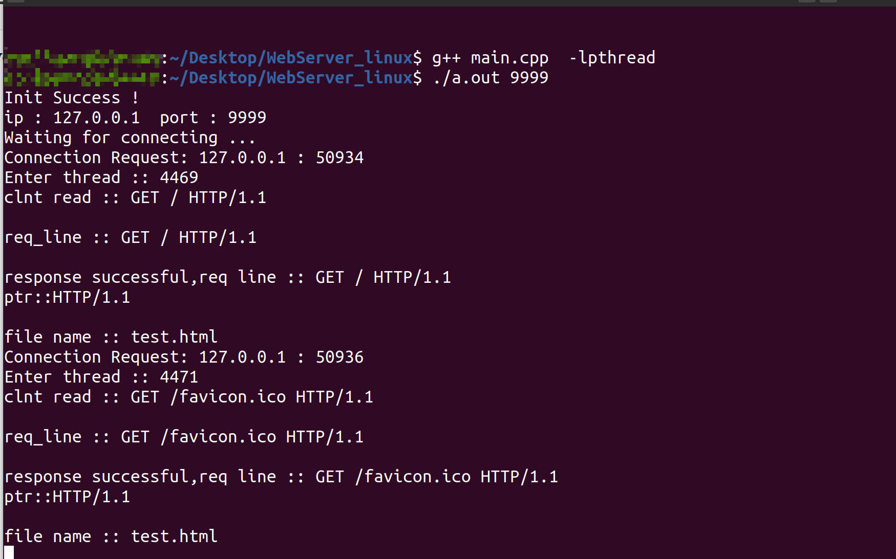

### 测试：实现简单的http服务端，请求返回html网页
#### 运行方法
* 编译生成执行文件`g++ main.cpp -lpthread -o a.out`，执行输出文件`./a.out 9999`，指定端口号为9999

* IP地址为“127.0.0.1”使用的本地回环地址（可根据自己地址修改）
  

* 通过访问地址`http://localhost:9999`请求页面
  client:
  
  server:
  